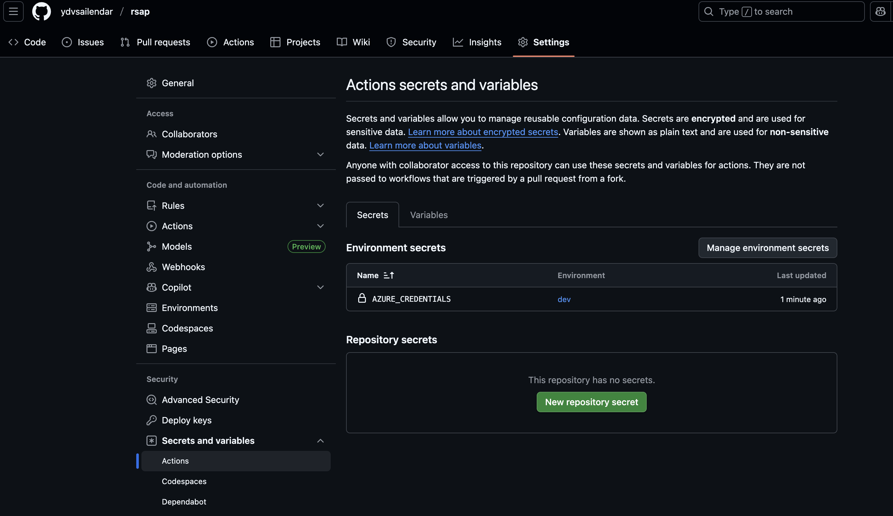

# README

_*To be followed after pre-requisite is completed (prerequisite.sh)*_

## Github Secrets for TF Deployment

- Ref: [Az Login](https://github.com/marketplace/actions/azure-login)

- Add the `AZURE_CREDENTIALS` in github actions environemnt specific secrets in json format as shown below
```json
{
    "clientSecret":  "******",
    "subscriptionId":  "******",
    "tenantId":  "******",
    "clientId":  "******"
}
```

- Where `clientSecret` is `password` && `clientId` is `appId` from the `create service principal` step
- if you are new to azure you can get the `tenant_id` and `subscription_id` using the az cli or the portal
```bash
az account list --output table
```



- Add Environment Specific backend configuration as shown below:
    - `TF_STATE_RESOURCE_GROUP`
    - `TF_STATE_STORAGE_ACCOUNT`
    - `TF_STATE_CONTAINER`
    - `TF_STATE_KEY`


