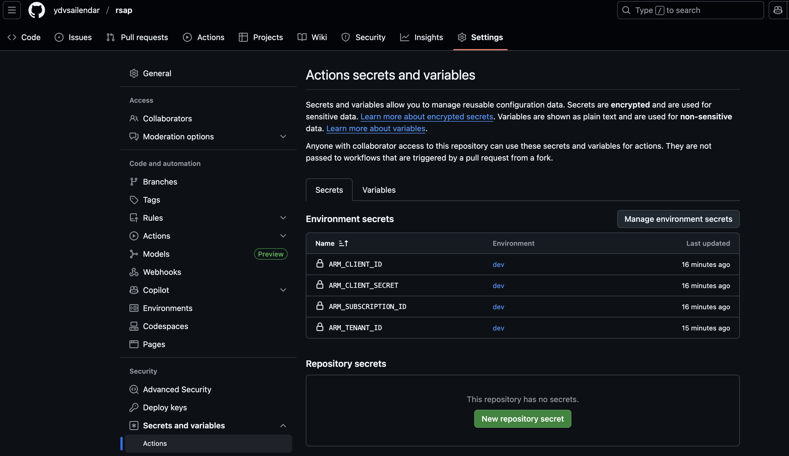

# README

_*To be followed after pre-requisite is completed (prerequisite.sh)*_

## Github Secrets for TF Deployment

- `appId` and `password` found on the response of create service principal step
- `SubscriptionId` and `TenantId` can be found as response of below command
    ```bash
    az account list --output table
    ```

- Add Environment Specific ARM Secrets as shown below:
    - `ARM_CLIENT_ID` -> `appId`
    - `ARM_CLIENT_SECRET` -> `password`
    - `ARM_SUBSCRIPTION_ID` -> `SubscriptionId`
    - `ARM_TENANT_ID` -> `TenantId`



- Add Environment Specific backend configuration as shown below:
    - `TF_STATE_RESOURCE_GROUP`
    - `TF_STATE_STORAGE_ACCOUNT`
    - `TF_STATE_CONTAINER`
    - `TF_STATE_KEY`


